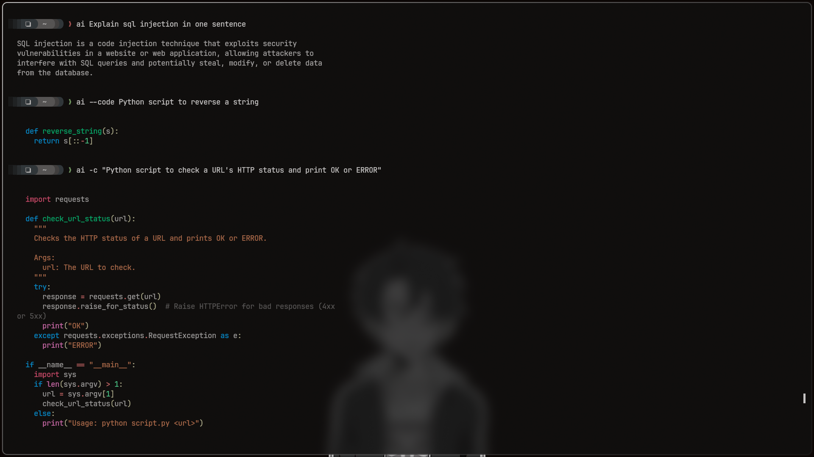

# ai-term



A lightweight terminal tool to query **Google AI Studio** straight from shell.  
No subscriptions needed — just grab a free API key from [Google AI Studio](https://aistudio.google.com/api-keys).  

Supports:  
- Quick Q&A from terminal  
- Code-only mode (`-c`)  
- Pretty markdown output with [glow](https://github.com/charmbracelet/glow) (optional, but recommended)  

---

## Install

```bash
curl -s https://raw.githubusercontent.com/MushroomWasp/ai-term/refs/heads/main/install.sh | bash
````

---

## Usage
> Note that I made the alias just `ai` for fast access

```bash
ai "Your question here"
ai -c "Your question here"   # code-only mode
```

If you run it with no arguments or `-h`, it shows help.

---

## Example

```bash
ai "Explain SQL injection in simple terms"
```

Output (with glow): nicely formatted markdown.

---

## Notes

* Requires: `curl`, `jq`
* Optional: `glow` for beautiful output
* Set your `API_KEY` inside `script.sh` before using
* Get your free API key here → [Google AI Studio](https://aistudio.google.com/api-keys)
